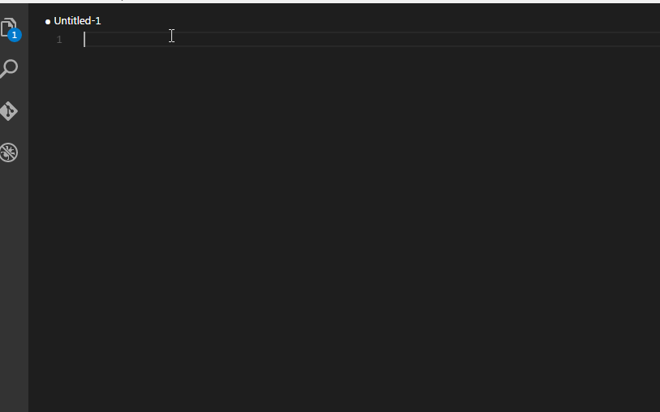
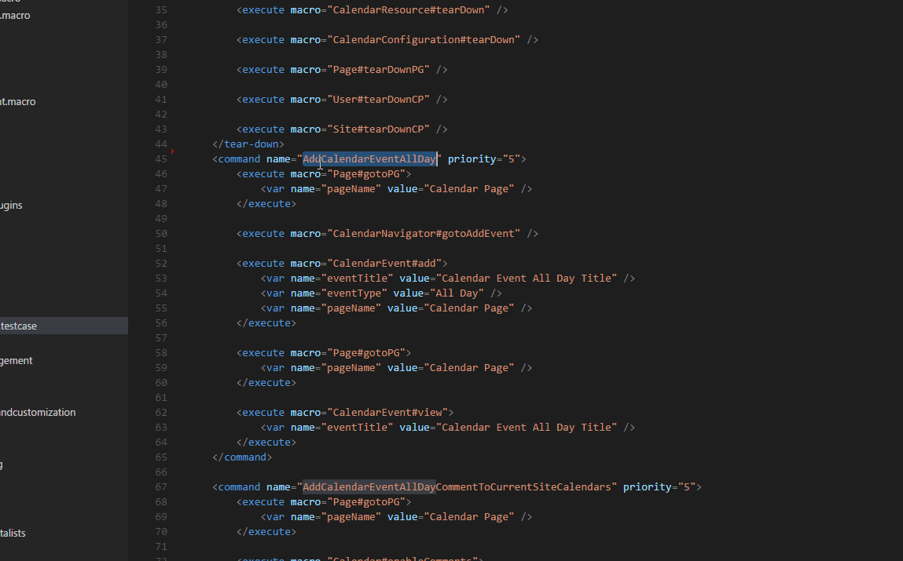
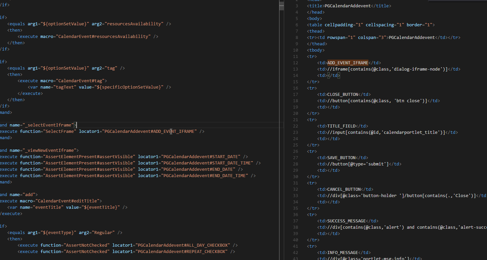
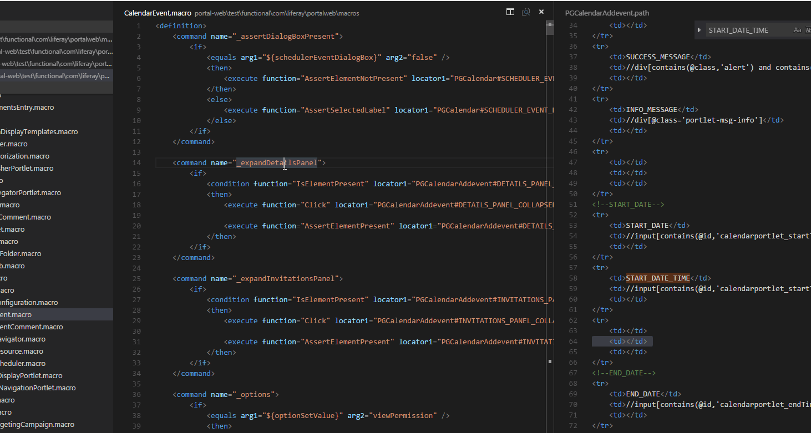

# POSHI

This extension is the support for POSHI in VS Code editor. 

Met some problems? You could refer [HERE](https://github.com/haoliangwu/vscode-poshi/wiki/Snippets-List-Doc).

Why I do this? READ [THIS](./INSPIRATION.md). Sorry for it was written by chinese.

## Installation
Please make sure you have installed Node v4+ env.

In order to install an extension you need to launch the Command Pallete (Ctrl + Shift + P or Cmd + Shift + P) and type `Extensions`. There you have either the option to show the already installed extensions or install new ones.

See more details [HERE](https://marketplace.visualstudio.com/items?itemName=lyon.POSHI).

**Also you can install it manually by using .vsix file, just drag and drop it to your editor.**

Then you need to set POSHI properties for extension by adding the following json segments to your setting.json file. 

The setting file in **User** level(File > Preferences > User Settings) will overwrite the default setting and **Workspace** level(File > Preferences > Workspace Settings) will overwrite the user setting again only for one particular project.

For Win, 
```
{
    // The absolute project path of Liferay Portal.
    "poshi.liferay.home": "C:\\liferay\\portal\\portal-6210",

    // The relative project path of POSHI.
	"poshi.project.home": "\\portal-web\\test\\functional\\com\\liferay\\portalweb"
}
```
For Mac/Linux,
```
{
	// The absolute project path of Liferay Portal.
	"poshi.liferay.home": "/home/lyon/liferay/portal/portal-6210",

	// The relative project path of POSHI.
	"poshi.project.home": "/portal-web/test/functional/com/liferay/portalweb"
}
```

Then when you open file with poshi ext rule(.testcase, .macro, .function and .path) at the first time, the initilization of index process will start automatically. When it finishs, you will notice the hint message **The poshi source mapping has initilized successfully.** displays on the editor top.

**Trouble Shooting**:
* I get **Your Liferay Home or POSHI Project HOME is not the valid path, please correct them or refer to example/package.json.** instead of successful hint message?

This hint message means your poshi properties didn't valid or contians some punctuations like space or other marks. Maybe it's not reasonable for your own habit, but it's better to keep the path pure. Please refer to the properties example above.

* I get **Your Liferay Home or POSHI Project HOME is null, please set them !!** instead of successful hint message?

This hint message means your poshi properties are empty, so set it before you start using the extension, you could refer to the properties example above.

* The poshi properties are valid, but I still can't get successful hint message?

This situation maybe happened you set properties after you open the files, please restart the editor or reopen the file to trigger the init process manually. 

* After extension installed, nothing happened.

It maybe caused by some errors(like dependencies error) that makes the installing process failed,so maybe you must download extension by git and install dependencies by npm. However, this trouble is quite rare.


## Usage Info
### Shortcut key
``alt + P``: open a testcase file by syntax like 'CPBlogs#RateBlogsEntry', you will enter CPBlogs.testcase shortly.

### Linters
All PO Linters:
* Testcase(In Progress)
* Macro(Pending)
* Function(Pending)
* Path(Pending)

To use Linters, you just need to do nothing. The Linters will trigger automatically considering the file's extension, eg: .testcase type will trigger testcaseLinter.

The Linters includes two level, **warning** and **error**. The warning level means the code could be more robust, the error level means the code has errors of syntax and format. 

### Symbol & Hover
* Symbol(In Progress)
* Hover(Pending)

This module just the implement of Symbol & Hover interface for POSHI(command block shortcut). 

To use Symbol just use (Ctrl + Shift + O or Cmd + Shift + O) to trigger Command Pallete and type the Symbol key, then focus will move to that command block. 

To use Hover just hover the mouse on KEY(eg: locator key), then the info panel will diaplay and show the infomation about the KEY.

### Reference Provider
* Definition(In Progress)
* Peek（In Progress)

To use Peek and Definition, please refer to official Docs about [Definition][1] and [Peek][2]. This extension only implements the definition interface about PO files.(.testcase, .macro, .function and .path). The completion feature also works out in Peek View.

### Completion Provider
* IntelliSense(In Progress)

To use InterlliSense, just same as other rich editor. The extension initialize the all segments about PO object. The InterlliSense menu will display when you type and try to bind the input chars to the ideal segment.

### ~~Debug~~
* ~~Static Debugger(Pending)~~
* ~~Dynamic Debugger(Pending)~~

## Usage Screenshot
### Snippets
> Generate the common templates with shortcut keys, even custom ones.



### Linter
> Give you instant hints about syntax or format issues.


### Completion
> Offer word completion by input text.


### Peek
> You can view reference files through Peek View, even edit.


### Definition
> Go to reference files directly by clicking the key word.


### Hover
> Give you instant value of variates, eg: locator and its value.


### Symbol
> You can focus on specific position of file by these symbols, say goodbye to search.


## Snippets Lists

The doc of whole triggers is [HERE](https://github.com/haoliangwu/vscode-poshi/wiki/Snippets-List-Doc)

[1]: https://code.visualstudio.com/docs/editor/editingevolved#_go-to-definition
[2]: https://code.visualstudio.com/docs/editor/editingevolved#_peek